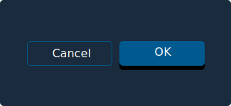

# Button

## Hi Amalya

Action Buttons allow users to trigger actions by clicking, tapping, or pressing a corresponding key on a keyboard, such as the “Enter” key.

::: note
This is a note
:::

::: note
This is a warning
:::

## Rules of Thumb {.rules-of-thumb}

- Use only predefined button colors, sizes and fonts — don’t customize or alter them.
- Don’t design elements which look similar to buttons but act differently. Buttons are actionable elements.
- Don’t activate Pop Up Menus from buttons.
- Buttons within the same group should be the same size. Use the width of the widest button.
- Space buttons evenly.
- Clearly title buttons by choosing a verb that describes the action the user performs at precisely the moment the button is clicked: “Save, Close, Print, \* Delete, Change Password,” etc.
- Resize button width to accommodate the title; do not abbreviate or truncate button titles.
- Don’t use an outside label to introduce a button. Instead, clearly title the button.
- Add an ellipsis (…) to the button title if it opens another window, Dialog Box or app.
- Within Dialog Boxes, right-justify buttons.

## Outline Button

Outline Buttons are an alternative button style to be used in situations where a de-emphasized button is beneficial in guiding the user to a preferred option. For example, use an outline button for the less preferred option in Ok/Cancel button pairings.

## Examples

<section class="dos-and-donts">

<section class="dos-and-donts">
<ul>
	<li>
		<figure>
			
		</figure>
		<figcaption>Do: Use buttons for actionable controls only</figcaption>
	</li>
	<li>
		<figure>
			
		</figure>
		<figcaption>Don’t: Use elements that look like buttons but are not</figcaption>
	</li>

</section>
